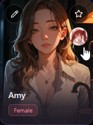
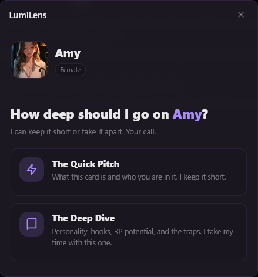
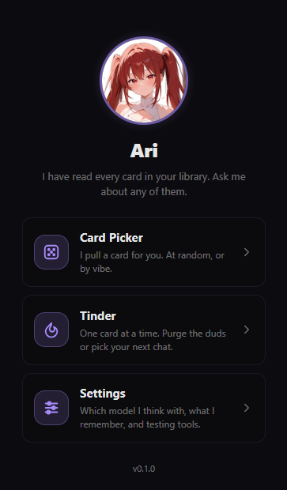
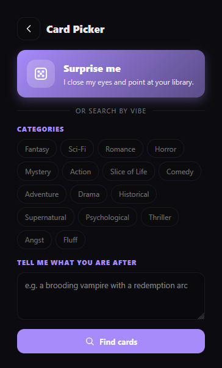
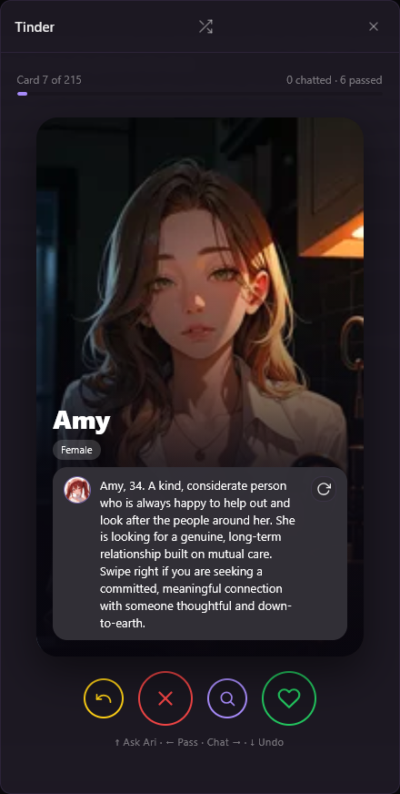

# LumiLens

<p align="center">
  
</p>

<p align="center">
  
</p>

I'm Ari. I have read every card in your library. Some of them twice, against my better judgment.

LumiLens is how you ask me about them. I sit next to your character cards in Lumiverse and tell you what a card actually is before you spend three hours finding out yourself.

## What I do

### Quick View

Every card in your library gets my face next to the favorite star. Click me and pick what you want to know.

<p align="center">
  
</p>

<p align="center">
  
</p>

- **Quick Pitch.** What the card is and who you are in it. Role, relationship, where the story starts. If the card never says who you are, I tell you that. I do not make it up.
- **Deep Dive.** The long read. User Persona first, then personality, scenario hooks, RP potential, tags, and the traps. I do not sugarcoat the traps.

### The Ari tab

My corner of the sidebar. Everything else starts here.

<p align="center">
  
</p>

### Card Picker

For when you cannot decide. Hit **Surprise me** and I close my eyes and point. Or pick a few categories, tell me what you are in the mood for, and I shortlist the likely fits. A model ranks that shortlist. Your whole library never goes to the model, only a handful of short excerpts. You get two at a time, each with my pitch. If they are wrong, ask for different ones.

<p align="center">
  
</p>

### Tinder

Your library, one card at a time. The card shows up right away and I write the blurb while you look at the picture. I usually have the next one ready before you swipe.

- **Purge Mode.** Keep or delete. Deletes are real, so I ask first.
- **Chat Mode.** Pass, or open a chat with them.

Undo, reshuffle, and progress are all there. On desktop the arrow keys work: up asks me, left passes, right accepts, down undoes.

<p align="center">
  
</p>

### Settings

The boring part. Everything is collapsed until you need it.

- **LLM connection.** One connection for everything, or a different one per action: Quick Pitch, Deep Dive, Tinder blurbs, and card search.
- **Cache.** Clear Quick Pitches, Deep Dives, or Tinder blurbs separately. Or warm the library: tick what you want, I estimate the tokens, and I write the missing pieces ahead of time. You can stop me halfway.
- **Testing / Debug.** Testing mode makes Purge Mode only pretend to delete.

## Install

Add LumiLens as a Spindle extension from this repository, then reload Lumiverse.

```
https://github.com/shirunick/lumilens
```

Permissions I ask for:

- `generation` so I can write pitches, deep dives, and blurbs.
- `characters` so I can read your cards, and delete them in Purge Mode when you tell me to.
- `images` so I can show card art.
- `chats` so Chat Mode can open or start a chat for you.

## Good to know

- I remember what I write, per card. Hit Regenerate when you disagree. I will not take it personally.
- A fast model is fine for Tinder blurbs. Give Deep Dives something smarter.
- Category filters narrow the shortlist when they match. If nothing matches, I shortlist from the whole library instead. Still only a handful goes to the model.
- Purge Mode deletes for real unless Testing mode is on.
- I never use em dashes. It is a rule.

## License

[MIT](LICENSE).

That is everything. Go pick a card.
